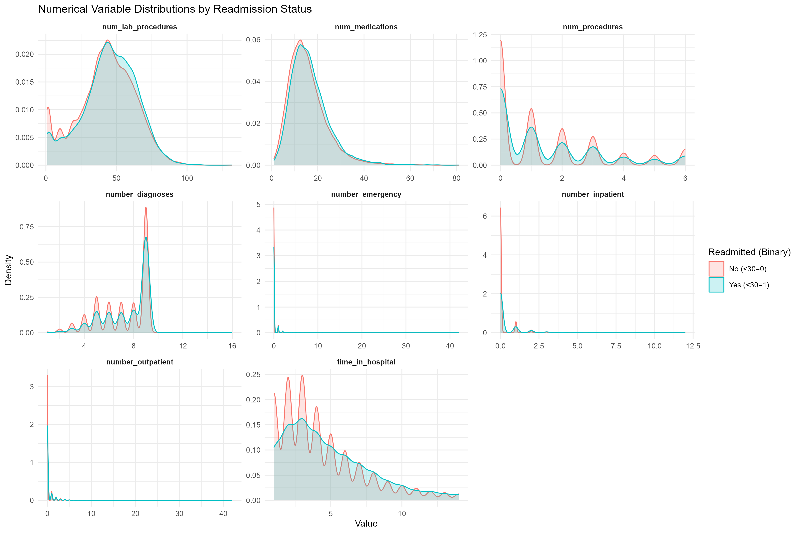
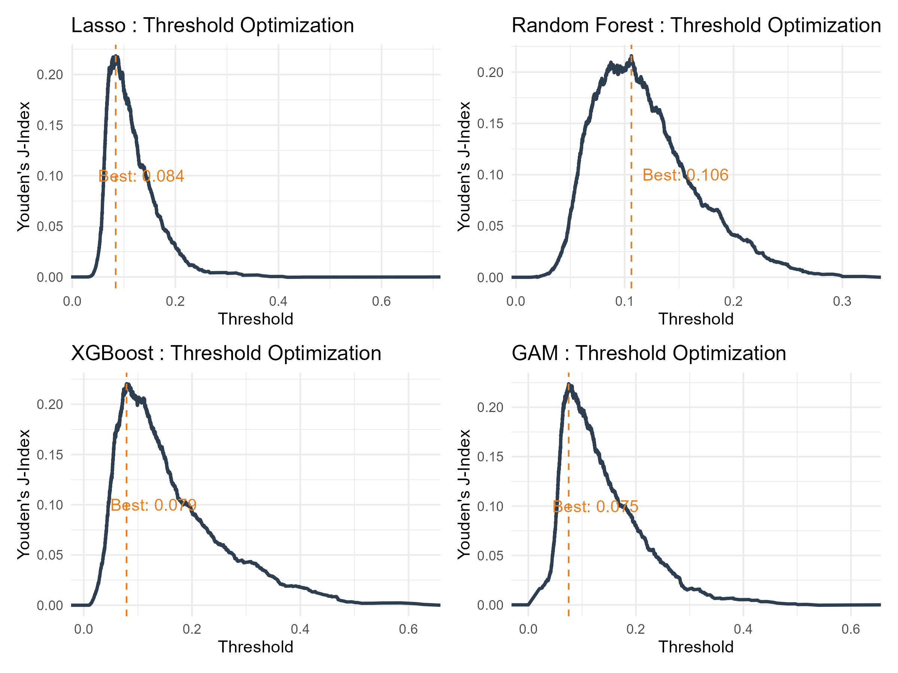
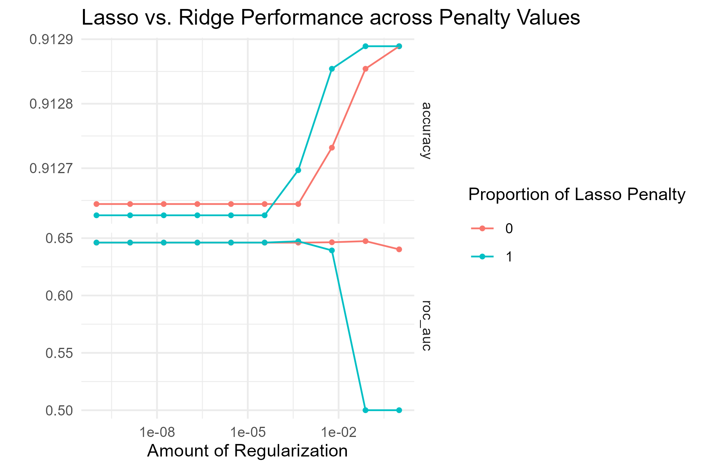
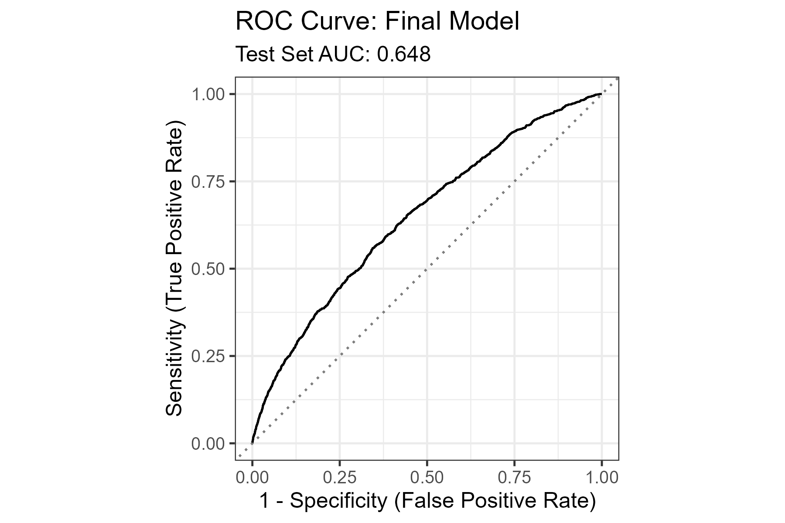
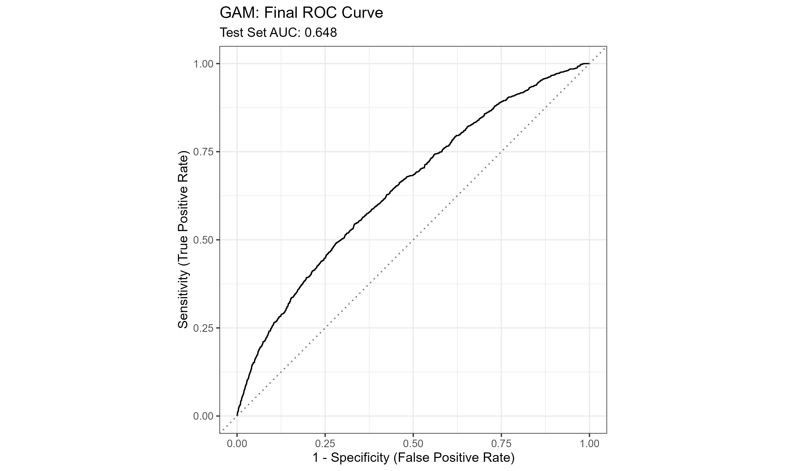
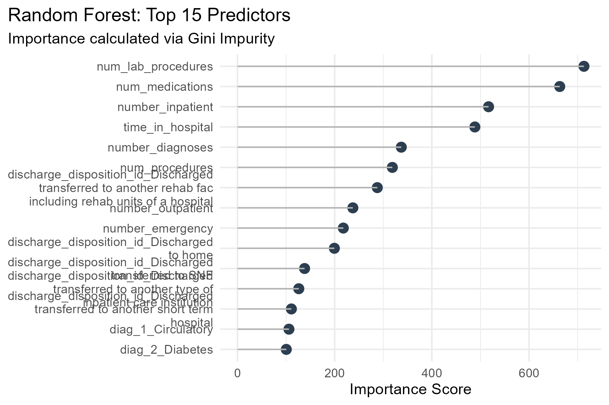
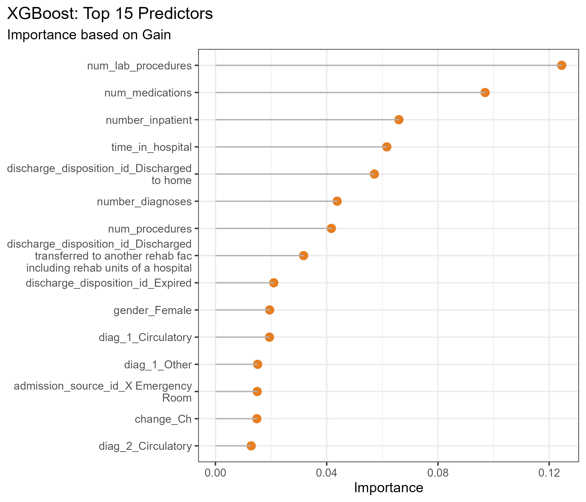
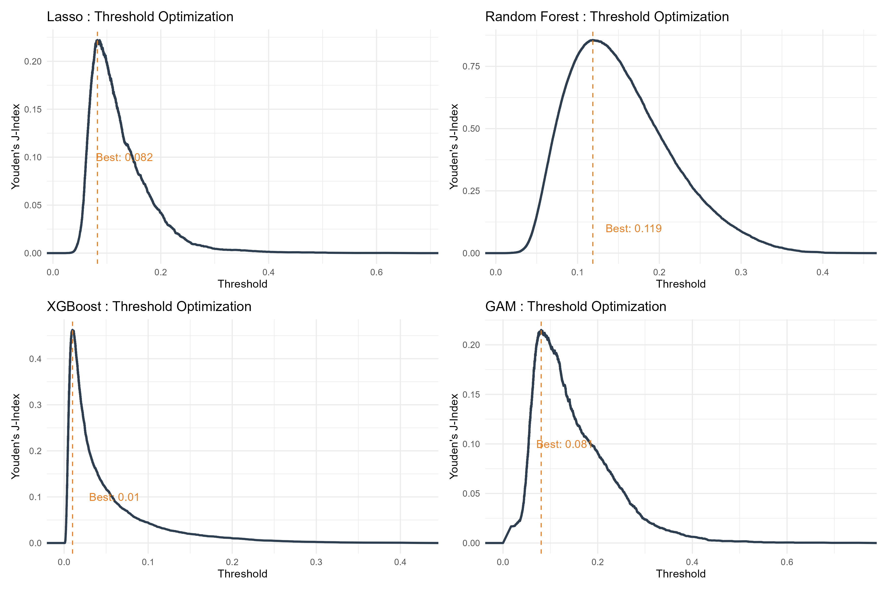

# Introduction

This project predicts 30-day hospital readmission for diabetes patients using the **Diabetes 130-US hospitals dataset (1999-2008)** from UCI. We compare regularized logistic regression, GAM, random forest, and XGBoost on the same cleaned patient-level dataset and evaluate mainly with ROC AUC due to class imbalance.

Project code: [stsci5740-project](https://github.com/kelvinchi02/stsci5740-project)

# Data Cleaning

## Patient-Level Deduplication

We retained only the first encounter per `patient_nbr` to avoid repeated-patient dependence. Sample size dropped from **101,766** to **71,518**.

## Sparse Feature Removal

Removed high-missingness variables:
- `weight` (96.01%)
- `medical_specialty` (48.21%)
- `payer_code` (43.41%)

## Missing and Invalid Values

- `race`: missing -> `Other`
- `max_glu_serum`, `A1Cresult`: `None` kept as valid level
- `gender`: removed `Unknown/Invalid`
- `diag_1`: removed missing rows (11)
- `diag_2`, `diag_3`: missing -> `None`

## Diagnosis Consolidation and Label Mapping

`diag_1`, `diag_2`, `diag_3` ICD-9 codes were grouped into 10 broader clinical categories to reduce high-cardinality levels. Administrative ID fields were mapped to descriptive categorical labels.

## Target Variable and Final Dataset

Defined `readmitted_binary`:
- `1`: original `readmitted = <30`
- `0`: original `readmitted = >30` or `NO`

Final cleaned dataset: **71,504 observations**, **47 variables**.

# Exploratory Data Analysis (EDA)

## Outcome Distribution

The target is imbalanced:
- `readmitted_binary = 0`: **65,213**
- `readmitted_binary = 1`: **6,291**

Minority class rate is about **8.8%**, so ROC AUC is emphasized over threshold-based accuracy metrics.

## Categorical Patterns

Key patterns from faceted count plots:
- `race` is dominated by Caucasian, then African American
- age is concentrated in older groups (especially **60-70**)
- administrative and medication variables are often highly unbalanced
- positive readmission remains the minority across most levels

## Numerical Distributions

Most utilization variables are right-skewed with long tails and substantial overlap between classes.

## Correlation Structure

Most pairwise correlations are low to moderate; no severe multicollinearity pattern is evident.

# Linear Modeling

We used regularized logistic models as interpretable baselines in a high-dimensional encoded feature space:
- Lasso (`L_1`) for sparsity
- Ridge (`L_2`) for coefficient shrinkage stability

## Preprocessing and Split

1. Stratified 80/20 train-test split by `readmitted_binary`.
2. One-hot encoding for categorical predictors.
3. Standardization for numeric predictors.
4. Same recipe/workflow applied to test data.

## Regularized Logistic Regression

Elastic net was tuned by cross-validation on ROC AUC over:
- `penalty` (`lambda`)
- `mixture` (`alpha`, 0 = Ridge, 1 = Lasso)

### Best Parameters

| Penalty (`lambda`) | Mixture (`alpha`) | Selected Model | Config |
|------------------:|------------------:|-----------------|-----------------|
| 0.0774 | 0 | Ridge Logistic Regression | `pre0_mod17_post0` |

Ridge slightly outperformed Lasso, suggesting signal is distributed across many predictors.

### Important Predictors

| Predictor | Coefficient | Interpretation |
|----------------------|---------------------------:|----------------------|
| `number_inpatient` | +0.1360 | Strongest positive readmission signal |
| Discharged / transferred to another rehab facility | +0.1200 | Higher post-discharge risk |
| Discharged to home | -0.0889 | Lower relative risk |
| Expired | -0.0825 | Negative due to coding/terminal outcome |
| Discharged to SNF | +0.0675 | Higher risk profile |
| `time_in_hospital` | +0.0425 | Longer stay, higher severity |
| `number_diagnoses` | +0.0365 | Greater comorbidity burden |
| `diag_1_Respiratory` | -0.0361 | Lower relative risk vs baseline |
| Age 50-60 | -0.0345 | Slightly lower relative risk |
| `diabetesMed_Yes` | +0.0332 | Medication may proxy severity |

Final Ridge test ROC AUC: **0.648**.

## Generalized Additive Model (GAM)

GAM was fit on the same split (binomial family, logit link) to allow smooth nonlinear effects while keeping additive interpretability.

| Smoothed Numerical Predictor |  EDF | Linear/Categorical Predictor |
|------------------------------|-----:|------------------------------|
| `time_in_hospital`           | 3.30 | `race`                       |
| `num_lab_procedures`         | 2.18 | `gender`                     |
| `num_medications`            | 1.04 | `age`                        |
| `number_diagnoses`           | 2.39 | `diabetesMed`                |
| `number_inpatient`           | 2.65 | `insulin`                    |
| `number_emergency`           | 2.10 | `discharge_disposition_id`   |

All smooth terms used `k = 5`; total EDF = **39.65**; UBRE = **-0.4338**.

Test ROC AUC: **0.648**. Strongest nonlinear signal came from `number_inpatient` and `number_emergency`.

# Nonlinear Modeling

## Random Forest (RF)

RF was tuned by cross-validation over `mtry` and `min_n` (500 trees, ROC AUC objective).

- ROC AUC: **0.651**
- Accuracy: **0.909**
- Precision: **0.909**
- Recall: **1.000**
- F1: **0.952**

## Gradient Boosted Trees (XGBoost)

XGBoost was tuned with racing over `tree_depth`, `min_n`, `loss_reduction`, `learn_rate`, and `sample_size` (1000 trees, early stopping = 10, ROC AUC objective).

- ROC AUC: **0.6558**
- Precision: **0.909**
- Recall: **1.000**
- F1: **0.952**

XGBoost delivered the best discrimination among tested models.

# Final Model Comparison

## Test Set Performance

| Model                     | ROC AUC | Precision | Recall | F1 Score |
|---------------------------|--------:|----------:|-------:|---------:|
| Ridge Logistic Regression |   0.648 |     0.909 |  1.000 |    0.952 |
| GAM                       |   0.648 |     0.909 |  1.000 |    0.952 |
| Random Forest             |   0.651 |     0.909 |  1.000 |    0.952 |
| XGBoost                   | **0.656** |   0.909 |  1.000 |    0.952 |

All models have similar threshold-based metrics due to class imbalance and default cutoff behavior. ROC AUC is the key differentiator.

## Default-Threshold Behavior

| Metric | Ridge Logistic Regression | GAM | Random Forest | XGBoost |
|---|---:|---:|---:|---:|
| Predicted positive cases | 2 | 6 | 0 | 10 |

# Threshold Optimization

Default cutoff (`0.50`) produced majority-class predictions. We re-optimized each model threshold using Youden's J statistic:

\[ J = \text{Sensitivity} + \text{Specificity} - 1 \]

## Tuned Confusion Matrices

::: {.columns}
::: {.column width="25%"}
**Ridge (t = 0.084)**

| Pred\\True | N | Y |
|---|---:|---:|
| N | 7,928 | 501 |
| Y | 5,090 | 782 |
:::
::: {.column width="25%"}
**RF (t = 0.106)**

| Pred\\True | N | Y |
|---|---:|---:|
| N | 10,027 | 727 |
| Y | 2,966 | 581 |
:::
::: {.column width="25%"}
**XGB (t = 0.079)**

| Pred\\True | N | Y |
|---|---:|---:|
| N | 7,653 | 482 |
| Y | 5,340 | 826 |
:::
::: {.column width="25%"}
**GAM (t = 0.075)**

| Pred\\True | N | Y |
|---|---:|---:|
| N | 7,298 | 432 |
| Y | 5,720 | 851 |
:::
:::

Threshold tuning increased sensitivity for minority-class readmissions, with more false positives.

- Most true positives: **GAM (851)**
- Next: **XGBoost (826)**
- Ridge: **782**
- Most conservative after tuning: **RF (581)**

# Final Conclusion

All models outperformed random guessing, with ROC AUC from **0.648 to 0.656**. **XGBoost** had the best overall discrimination (**0.656**), with **Random Forest** second (**0.651**). **Ridge** and **GAM** remained competitive (**0.648** each).

Important predictors were consistent across models: prior utilization, treatment intensity, disease burden, and discharge disposition.

Given class imbalance, threshold selection strongly affects operational usefulness. After tuning, **GAM and XGBoost** gave the strongest readmission detection.
