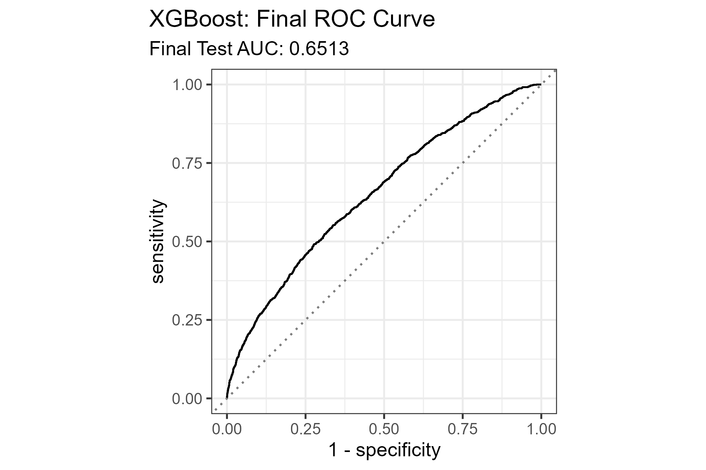
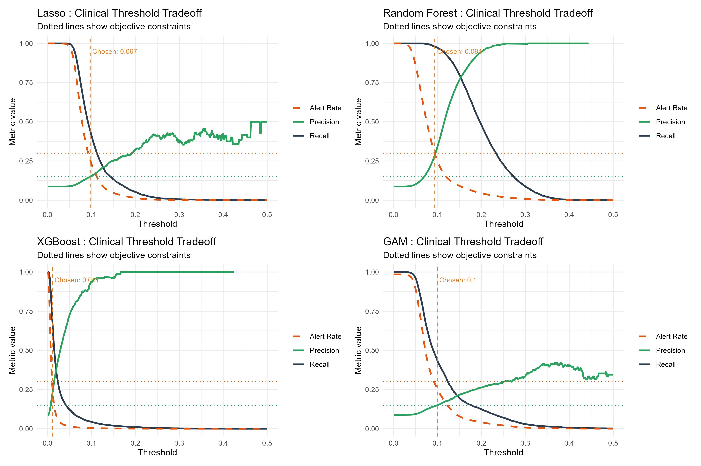

# Introduction

This report presents a machine-learning analysis of 30-day readmission among diabetes-related encounters using the UCI Diabetes 130-US hospitals dataset (1999-2008). The dataset contains demographic variables, diagnosis fields, laboratory information, medication records, and prior utilization history from 130 U.S. hospitals.

Linear, additive, and tree-based classifiers are compared under class imbalance, and ranking performance is subsequently mapped to an operational threshold policy. The primary objective is to identify a model-threshold pair that satisfies a minimum precision requirement while maintaining outreach volume within capacity constraints.

Project repository: [stsci5740-project](https://github.com/kelvinchi02/stsci5740-project).

# Data Preparation

Raw data contained 101,766 encounters. Cleaning was performed to create a patient-level modeling dataset suitable for fair train-test evaluation.

## Cleaning Steps

1. Patient-level deduplication:
  Keep the first encounter per unique `patient_nbr` to avoid repeated-observation dependence. Sample size reduced to 71,518 rows.
2. Sparse feature removal:
  Remove `weight` (96.01% missing), `medical_specialty` (48.21% missing), and `payer_code` (43.41% missing).
3. Missing and invalid value treatment:
  Recode `race` missing as Other, keep `None` as valid category for `max_glu_serum` and `A1Cresult`, remove `gender = Unknown/Invalid`, remove 11 missing `diag_1` rows, and recode missing `diag_2/diag_3` as None.
4. Diagnosis consolidation:
  Group high-cardinality ICD-9 codes in `diag_1`, `diag_2`, and `diag_3` into clinically meaningful categories.
5. Metadata mapping:
  Convert coded administrative IDs to descriptive labels.
6. Target creation:
  Build binary `readmitted_binary`, where 1 indicates `<30` and 0 indicates `>30` or `NO`.

Final modeling dataset:

- 71,504 observations
- 47 variables

# EDA Summary

## Outcome Imbalance

Readmission within 30 days is rare: 65,213 negatives versus 6,291 positives (8.8% positive rate). This motivates ranking metrics (ROC AUC, PR AUC) and threshold-policy analysis, rather than relying only on default class predictions.

## Predictor Patterns

- Categorical distributions are uneven across race, age, and administrative fields.
- Medication indicators are dominated by the No level.
- Numeric utilization variables are right-skewed with long tails.
- Correlation structure is mostly low to moderate, with stronger links among utilization measures.

These patterns support testing both regularized linear methods and nonlinear models.

# Modeling Design

## Split, Preprocessing, Metrics

- Stratified 80/20 train-test split by `readmitted_binary`
- One-hot encoding for categorical variables; scaling for regularized linear models
- Primary ranking metrics: ROC AUC and PR AUC
- Classification behavior evaluated with precision, recall, specificity, and confusion matrices

## Candidate Models

| Model | Core Setup | Final Tuning Focus |
|---|---|---|
| Ridge/Lasso Logistic Regression | Elastic net logistic regression with CV over `penalty` and `mixture` | ROC AUC |
| GAM | Additive logistic model with smooth terms on utilization-related numeric predictors | Fixed smooth structure; evaluated on held-out test |
| Random Forest | Tree ensemble tuned over `mtry` and `min_n` | PR AUC (imbalance-aware final pass) |
| XGBoost | Gradient-boosted trees with racing and early stopping | ROC AUC |

Model assessment was conducted in two stages: first by ranking metrics on held-out data, and then by objective-constrained threshold evaluation. This structure separates discrimination quality from operational decision policy and improves interpretability of the final recommendation.

# Linear and Additive Model Findings

## Ridge Logistic Regression

Cross-validation selected a Ridge-dominant elastic net configuration.

| Penalty (lambda) | Mixture (alpha) | Selected Linear Model |
|---:|---:|---|
| 0.0774 | 0.0 | Ridge Logistic Regression |

Key coefficient patterns from the selected ridge model:

| Predictor | Coefficient | Directional interpretation |
|---|---:|---|
| `number_inpatient` | +0.1360 | Stronger prior inpatient burden increases risk |
| `Discharged/transferred to rehab facility` | +0.1200 | Complex discharge pathways signal higher risk |
| `Discharged to home` | -0.0889 | Home discharge associated with lower risk |
| `time_in_hospital` | +0.0425 | Longer stay proxies higher severity |
| `number_diagnoses` | +0.0365 | Greater comorbidity burden increases risk |
| `diabetesMed_Yes` | +0.0332 | Medication use likely captures disease intensity |

Ridge achieved ROC AUC 0.648 and PR AUC 0.167 on held-out test data.

## Generalized Additive Model (GAM)

The GAM relaxed linearity for key utilization predictors while keeping additive interpretability.

| Smoothed Numerical Predictor | EDF |
|---|---:|
| `time_in_hospital` | 3.30 |
| `num_lab_procedures` | 2.18 |
| `num_medications` | 1.04 |
| `number_diagnoses` | 2.39 |
| `number_inpatient` | 2.65 |
| `number_emergency` | 2.10 |

GAM delivered ROC AUC 0.648 and PR AUC 0.166, indicating competitive discrimination but limited gain over ridge in this dataset.

# Tree-Based Model Findings

Random Forest and XGBoost improved ranking metrics relative to linear/additive models, but default thresholds were too conservative for positive-class detection.

- Random Forest: ROC AUC 0.650, PR AUC 0.179
- XGBoost: ROC AUC 0.651, PR AUC 0.181

Both models predicted almost no positive cases under default decision thresholds, which made post-model threshold optimization essential.

XGBoost feature importance further highlighted utilization intensity and discharge pathway variables as dominant contributors.

## XGBoost ROC Diagnostic

The held-out ROC curve confirms stable discrimination for XGBoost at the ranking stage before threshold tuning.

# Consolidated Model Results (Default Thresholds)

The table below merges key test-set default-threshold results across all models to reduce duplication and keep comparisons aligned.

| Model | ROC AUC | PR AUC | Default Precision | Default Recall | Default Specificity | Predicted Positive Cases |
|---|---:|---:|---:|---:|---:|---:|
| Ridge Logistic Regression | 0.648 | 0.167 | 0.909 | 1.000 | 0.001 | 2 |
| GAM | 0.648 | 0.166 | 0.909 | 1.000 | 0.002 | 6 |
| Random Forest | 0.650 | 0.179 | N/A | 0.000 | 1.000 | 0 |
| XGBoost | 0.651 | 0.181 | N/A | 0.000 | 1.000 | 0 |

`N/A` precision for RF/XGBoost occurs because no positive events were predicted under default thresholds.

Interpretation:

- XGBoost had the strongest ranking performance (ROC AUC and PR AUC).
- RF was close in ROC AUC but slightly lower in PR AUC.
- Ridge and GAM remained competitive in ROC AUC but weaker on PR AUC and unsuitable as-is under default classification thresholds.

# Threshold Optimization

Thresholds were selected on CV predictions from training data and evaluated once on held-out test data. No held-out test labels were used during threshold selection.

Clinical objective:

- Minimum precision: 0.15
- Maximum alert rate: 0.30
- Among feasible thresholds, maximize recall

## Threshold Tradeoff Plot

## Selected CV Thresholds

| Model | Threshold | Selection Mode |
|---|---:|---|
| Lasso | 0.097 | meets constraints |
| Random Forest | 0.094 | meets constraints |
| XGBoost | 0.011 | meets constraints |
| GAM | 0.100 | meets constraints |

## Held-out Objective Check

| Model | Precision | Recall | Specificity | F1 | Balanced Accuracy | Alert Rate | Meets Objective |
|---|---:|---:|---:|---:|---:|---:|---|
| Lasso | 0.154 | 0.435 | 0.760 | 0.228 | 0.597 | 0.258 | Yes |
| Random Forest | 0.137 | 0.541 | 0.657 | 0.219 | 0.599 | 0.361 | No |
| XGBoost | 0.155 | 0.457 | 0.750 | 0.232 | 0.604 | 0.269 | Yes |
| GAM | 0.157 | 0.430 | 0.767 | 0.230 | 0.599 | 0.251 | Yes |

## Tuned Confusion Matrix Counts

| Model | TN | FP | FN | TP |
|---|---:|---:|---:|---:|
| Lasso | 9,872 | 3,121 | 739 | 569 |
| Random Forest | 8,533 | 4,460 | 600 | 708 |
| XGBoost | 9,745 | 3,248 | 710 | 598 |
| GAM | 9,963 | 3,030 | 745 | 563 |

## Error Tradeoff View

To compare operational error patterns beyond recall and precision alone, we summarize false-negative and false-positive rates under each tuned threshold.

| Model | False Negative Rate | False Positive Rate | Interpretation |
|---|---:|---:|---|
| Lasso | 0.565 | 0.240 | Lower alert burden than RF, but misses more positives |
| Random Forest | 0.459 | 0.343 | Best capture of positives, but too many alerts |
| XGBoost | 0.543 | 0.250 | Balanced error profile under objective constraints |
| GAM | 0.570 | 0.233 | Lowest false positives among feasible models, but highest misses |

This comparison reinforces the final choice: XGBoost is not the most aggressive detector, but it provides the strongest feasible recall while keeping false-positive burden within the stated project constraints.

Interpretation of objective-constrained tuning:

- Random Forest achieved the highest recall but violated operational constraints due to low precision and high alert rate.
- XGBoost, Lasso, and GAM all satisfied objective constraints on held-out data.
- XGBoost was selected because it provided the best recall among feasible options while maintaining precision and alert-rate limits.

Recommendation under objective constraints: XGBoost at threshold 0.011.

# Model Selection Rationale

Two-stage model selection was used so that ranking quality and operational feasibility were both evaluated explicitly.

## Stage 1: Ranking Performance

Initial comparison prioritized ROC AUC and PR AUC. XGBoost and RF led this stage, while Ridge and GAM remained competitive but lower on PR AUC.

## Stage 2: Objective-Constrained Thresholding

Thresholds were then chosen from CV predictions under the project objective (minimum precision 0.15, maximum alert rate 0.30, maximize recall).

| Model | Stage 1 Ranking Position | Meets Objective | Key reason |
|---|---|---|---|
| XGBoost | 1 | Yes | Best feasible recall under precision and alert-rate limits |
| Random Forest | 2 | No | Recall high but alert rate too high and precision too low |
| Lasso/Ridge | 3 | Yes (Lasso threshold) | Feasible but lower recall than XGBoost |
| GAM | 4 | Yes | Feasible and stable, but recall below XGBoost |

This stage-wise process explains why the final recommendation is XGBoost even though Random Forest had higher raw recall after tuning.

## Validity and Reproducibility Considerations

Methodological validity was strengthened through stratified train-test splitting, workflow-based preprocessing, and strict separation between threshold tuning on cross-validation predictions and final evaluation on held-out test data. This design reduces optimistic bias and clarifies the difference between ranking quality (ROC AUC, PR AUC) and thresholded operating performance (precision, recall, alert rate). The full pipeline is reproducible from the cleaned dataset and saved model artifacts.

# Final Conclusion

Model choice improved ranking performance modestly (ROC AUC 0.648 to 0.651), but operational utility depended more strongly on threshold policy than on algorithm selection alone. Under a care-management objective with explicit precision and capacity constraints, XGBoost provided the most suitable deployable balance:

- Precision: 0.155
- Recall: 0.457
- Specificity: 0.750
- F1: 0.232
- Balanced Accuracy: 0.604
- Alert Rate: 0.269

Methodological implications:

- A leakage-safe threshold workflow should be treated as an integral component of model development rather than a post-hoc reporting step.
- In imbalanced readmission prediction, ranking metrics and objective-constrained threshold policies are more decision-relevant than default class labels.
- The selected model is justified by feasibility under explicit precision and alert-rate constraints, not by ROC AUC alone.

\newpage

# Appendix {-}

## EDA Figures

## Linear/GAM Diagnostics

## Tree-Model Diagnostics

